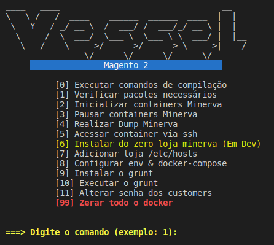

<table>
    <tr>
        <td>
            
        </td>
        <td>
            <h1 style="font-weight:bold">Vessel Private</h1>
        </td>
    </tr>
</table>

---

## Sobre
Vessel é um programa feito com shell scripts para agilizar o ambiente de desenvolvimento Magento 2.

---

# Vessel

## Comandos

### [0] Executar comandos de compilação:
Função: Executa uma série de comandos relacionados à compilação do projeto. Pode envolver a compilação de arquivos CSS/JS ou outros artefatos necessários para o Magento.

### [1] Verificar pacotes necessários:
Função: Verifica se todos os pacotes necessários (como PHP, Composer, Docker) estão instalados e configurados corretamente no sistema.

### [2] Inicializar containers `$CONTAINER`:
Função: Inicia os containers Docker associados ao projeto, permitindo que o ambiente de desenvolvimento seja iniciado.

### [3] Pausar containers `$CONTAINER`:
Função: Pausa os containers Docker em execução, colocando o ambiente de desenvolvimento em pausa.

### [4] Realizar Dump `$CONTAINER`:
Função: Faz um dump (cópia) do banco de dados ou outros dados importantes do container.

### [5] Acessar container via ssh:
Função: Abre uma sessão SSH dentro de um container específico, permitindo a execução de comandos diretamente dentro do ambiente do container.

### [6] Clonar Projeto:
Função: Clona o repositório do projeto a partir de uma origem, como Git, para o diretório local.

### [7] Adicionar loja /etc/hosts:
Função: Adiciona entradas no arquivo `/etc/hosts` para que a loja Magento seja acessível por um domínio específico localmente.

### [8] Configurar env & docker-compose:
Função: Configura variáveis de ambiente e prepara o arquivo `docker-compose.yml` para o projeto, configurando os serviços necessários.

### [9] Instalar o grunt:
Função: Instala o Grunt, uma ferramenta de automação de tarefas JavaScript, que pode ser usada para tarefas como minificação de arquivos, compilação de CSS/JS, etc.

### [10] Executar o grunt:
Função: Executa tarefas automatizadas definidas no Grunt, como compilação de CSS, minificação de arquivos JavaScript, etc.

### [11] Alterar senha dos customers:
Função: Altera as senhas dos clientes no banco de dados Magento, possivelmente para uma senha padrão para fins de teste.

### [12] Alterar todas as bases urls:
Função: Altera as URLs base do Magento no banco de dados, útil quando movendo o site para um novo domínio ou ambiente.

### [13] Desabilitar módulos auth admin:
Função: Desabilita módulos de autenticação no admin do Magento, possivelmente para facilitar o desenvolvimento ou depuração.

### [14] Change Project:
Função: Altera o projeto ativo no ambiente de desenvolvimento, permitindo que você trabalhe em diferentes projetos Magento.

### [15] Executar cron:
Função: Executa os jobs agendados (cron jobs) do Magento, que são usados para várias tarefas, como reindexação, envio de e-mails, etc.

### [16] Limpeza de tabelas de log:
Função: Limpa as tabelas de log do banco de dados, que podem crescer com o tempo e afetar o desempenho.

### [17] Fazer Backup Banco e Projeto:
Função: Faz um backup completo do banco de dados e possivelmente dos arquivos do projeto.

### [18] Executar adminer:
Função: Inicia o Adminer, uma ferramenta de gerenciamento de banco de dados, permitindo que você gerencie o banco de dados do Magento via interface web.

### [99] Zerar todo o docker:
Função: Para e remove todos os containers, volumes e imagens Docker relacionados ao projeto, resetando o ambiente Docker.

---

## Configuração

## Variáveis de Configuração no .env

- **ROOT_PASSWORD**: Senha do usuário root que será utilizada em diversos comandos do script, como operações sensíveis no banco de dados.
    - **Exemplo**: `ROOT_PASSWORD=a`
  

- **WAIT_TIME**: Tempo de espera (em segundos) utilizado pelo script em determinados pontos, como para aguardar a inicialização de containers ou serviços.
    - **Exemplo**: `WAIT_TIME=10`

- **PROJECT**: Caminho completo para o diretório do projeto Magento 2 no sistema de arquivos. Esta variável é usada para navegação e operações no projeto.
    - **Exemplo**: `PROJECT=$HOME/Documentos/minerva-magento2`
  

- **PHP_VERSION**: Versão do PHP que será utilizada no ambiente. Deve corresponder à versão instalada e compatível com o projeto Magento 2.
    - **Exemplo**: `PHP_VERSION=php8.1`
  

- **CUSTOMER_EMAIL_CHANGE_PASSWORD**: E-mail do cliente cuja senha será alterada pelo script durante a execução de um dump ou outra operação relacionada ao banco de dados.
    - **Exemplo**: `CUSTOMER_EMAIL_CHANGE_PASSWORD=pedro.ramos2@infobase.com.br`
  

- **KEY_CUSTOMER_ORDER_MINERVA**: Chave única usada para identificar pedidos na área do cliente Minerva. Esta chave pode ser usada para autenticação ou operações relacionadas a pedidos.
    - **Exemplo**: `KEY_CUSTOMER_ORDER_MINERVA=b2bcb206aa49542d47b3747a99514d02`

- **URL_LOCAL**: URL local configurada para acessar o ambiente Magento 2 via Docker. Esta URL será usada para definir as bases URLs no Magento e acessar o site durante o desenvolvimento.
    - **Exemplo**: `URL_LOCAL=https://magento2.docker/`

- **USER_BITBUCKET**: Nome de usuário do Bitbucket que será utilizado para operações de Git, como clonar repositórios. É necessário que este usuário tenha as permissões adequadas no repositório.
    - **Exemplo**: `USER_BITBUCKET=PedroDinizRamos`

- **PASSWORD_BITBUCKET**: Senha ou token de acesso gerado no Bitbucket para autenticar operações de Git. Deve ser gerado no Bitbucket e inserido aqui para permitir clonar ou puxar repositórios.
    - **Exemplo**: `PASSWORD_BITBUCKET=`