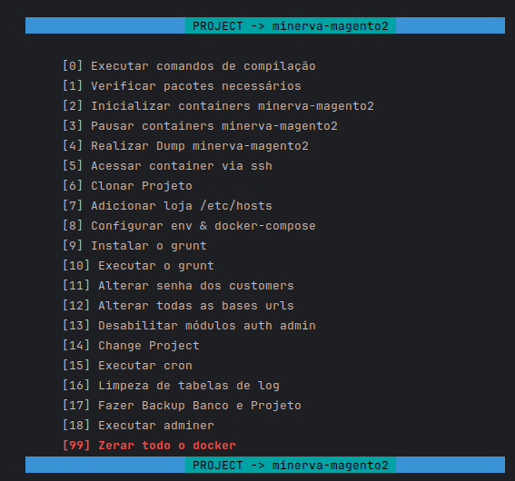

<table>
    <tr>
        <td>
            
        </td>
        <td>
            <h1 style="font-weight:bold">Vessel Private</h1>
        </td>
    </tr>
</table>

---

## Sobre
Vessel é um programa em feito com shell scripts para agilizar o ambiente de desenvolvimento Magento 2.

---

# Vessel

## Comandos

- 0 -> Executa o s:up && s:di:c
- 1 -> Verifica os pacotes necessarios instalado no computador.
- 2 -> Inicializa os containers da Minerva
- 3 -> Pausa os containers da Minerva
- 4 -> Realiza dump do magento cloud e faz a instalação do dump com as devidas configurações, caso não tenha o magento-cloud basta deixar o dump na pasta raiz do projeto com o nome db.sql
- 5 -> Acessa SSH
- 6 -> Em Desenvolvimento
- 7 -> Adiciona a url no etc/hosts
- 8 -> Configura o env e docker para que o vessel tenha acesso aos containers
- 9 -> Instala grunt 
- 10 -> Executa grunt
- 11 -> Altera a senha de todos os customers para teste
- 99 -> Deleta tudo do docker (prune all)

---

## Configuração

Necessario realizar a configuração no .env
- ROOT_PASSWORD (Sua senha do root)
- MINERVA_PROJECT (Caminho do projeto da Minerva)
- CUSTOMER_EMAIL_CHANGE_PASSWORD (Qual usuario é pra ser alterado a senha no momento do dump)
- KEY_CUSTOMER_ORDER_MINERVA (Key dos pedidos na area do cliente)
- URL_LOCAL (Url a ser configurada no dump)